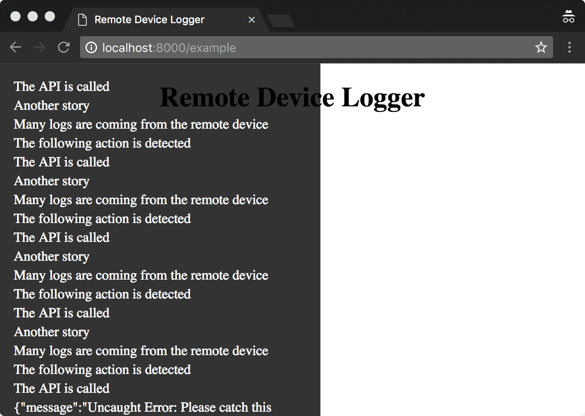

# remote-device-logger

A logging tool for a remote device equipped with no inspector to send a log to the receiver via WebSocket.




Install
---

```sh
$ npm i remote-device-logger --save-dev
```

Usage
---

Start the remote-device-logger cli on the server-side.  This is the log receiver.

```sh
$ remote-device-logger -p 8080
```

Send logs from the client-side.

```js
import RDL from 'remote-device-logger';

const logger = new RDL({
  element: document.body,
  webSocketUrl: `ws://${ location.hostname }:8080`,
});

// log() method sends and displays logs.
logger.log('Client launched');
logger.log('This log message is sent by Remote Device Logger');

// remote-device-logger catches errors, too.
throw new Error('Please catch this error');
```

You will find logs on the client-side and the same logs in the standard output on the server-side.

```sh
Log receiver is listen on 8080
Client says: {"message":"Uncaught Error: Please catch this error","fileName":"http://localhost:8000/example","lineNumber":17,"columnNumber":7,"location":"http://localhost:8000/example","userAgent":"Mozilla/5.0 (Macintosh; Intel Mac OS X 10_12_3) AppleWebKit/537.36 (KHTML, like Gecko) Chrome/63.0.3239.90 Safari/537.36"} This log message is sent by Remote Device Logger Client launched
Client says: WebSocket opened
```

API Document
---

[https://ygoto3.github.io/remote-device-logger/class/remote-device-logger/index.js~RemoteDeviceLogger.html](https://ygoto3.github.io/remote-device-logger/class/remote-device-logger/index.js~RemoteDeviceLogger.html)

Run the example
---

Start the receiver

```sh
$ yarn receiver
```

Start the Web server

```sh
$ yarn example
```

Then, open `http://localhost:8000/example`
